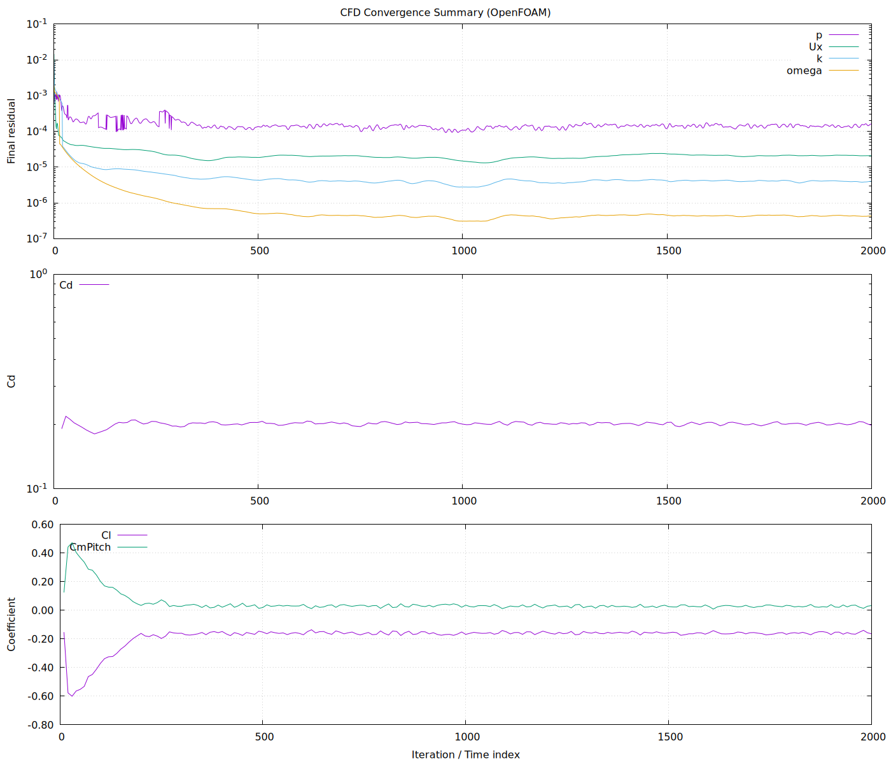

# OpenFOAM Run Notes (Phase 1)

This case uses OpenFOAM for steady-state external aerodynamics of a simplified vehicle body.

## Solver
- Solver: simpleFoam
- Flow type: incompressible, steady-state
- Purpose: numerical stability and qualitative flow interpretation

## Boundary conditions (high level)
- Inlet: uniform velocity (freestream)
- Outlet: fixed pressure
- Vehicle surface: no-slip wall
- Remaining boundaries: far-field treatment

## Turbulence modeling
- RANS-based turbulence model suitable for steady external flow
- Model selection aimed at robustness rather than high-fidelity force prediction

## Convergence criteria
Convergence was assessed using:
- residual reduction across governing equations
- stabilization of integrated force coefficients over successive iterations

Residual decay alone was not treated as sufficient evidence of convergence. Practical convergence was confirmed only after force coefficients stabilized over multiple iterations.

Residual histories and force coefficient trends showing numerical convergence and stabilization of the steady-state solution.

## Scope and limitations
- no moving ground or rotating wheels
- results interpreted qualitatively rather than quantitatively
